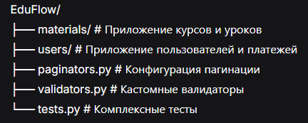

# EduFlow 🎓

**EduFlow** — современная образовательная платформа для создания и прохождения курсов и уроков с интегрированной платежной системой и системой подписок.

## 🚀 Возможности

### 📚 Образовательный функционал
- Создание структурированных курсов с модулями и уроками
- Управление контентом уроков (видео, описания, превью)
- Автоматический подсчет уроков в курсах
- Полный CRUD для курсов и уроков
- **NEW** Пагинация для курсов и уроков
- **NEW** Валидация YouTube ссылок в уроках

### 🔐 Безопасность и права доступа
- **NEW** JWT аутентификация с SimpleJWT
- **NEW** Ролевая модель: пользователи, модераторы, администраторы
- **NEW** Объектно-уровневые права доступа
- **NEW** Модераторы могут просматривать и редактировать любой контент, но не создавать/удалять
- **NEW** Пользователи видят и редактируют только свои курсы и уроки

### 👨‍🏫 Система пользователей
- Кастомная модель пользователя с авторизацией по email
- Расширенный профиль (телефон, город, аватар)
- История платежей в профиле пользователя
- **NEW** Публичный и приватный просмотр профилей
- **NEW** Любой авторизованный пользователь может просматривать профили других пользователей
- **NEW** Редактировать можно только свой профиль

### 💰 Платежная система
- Полная система платежей за курсы и уроки
- Поддержка разных способов оплаты (наличные, перевод)
- Фильтрация и сортировка платежей
- История платежей в реальном времени

### 🔔 Система подписок
- **NEW** Подписка на обновления курсов
- **NEW** Уведомления о новых уроках
- **NEW** Управление подписками через API

### 🔧 API возможности
- REST API с Django REST Framework
- Фильтрация платежей по курсу, уроку, способу оплаты
- Сортировка по дате и сумме платежей
- Вложенные сериализаторы для связанных данных
- **NEW** Пагинация с настраиваемым размером страницы
- **NEW** Полная TypeScript-совместимость с аннотациями типов

## 🛠 Технологии

- **Backend**: Python 3.12, Django 5.2
- **API**: Django REST Framework
- **База данных**: SQLite (разработка), готова к миграции на PostgreSQL
- **Качество кода**: flake8, black, isort, mypy
- **Аутентификация**: JWT с SimpleJWT
- **Типизация**: Полная аннотация типов Python

## 📁 Структура проекта


## 🚀 Установка и запуск

1. **Клонируйте репозиторий:**
```bash
git clone <url-репозитория>
cd EduFlow
```
2. **Установите зависимости:**

```bash
pip install -r requirements.txt
```
3. **Скопируйте шаблон:**
```text
# cp .env.example .env
# Отредактируйте .env файл
# Заполните Stripe ключи с https://dashboard.stripe.com/test/apikeys
```
```bash
python manage.py migrate
```
4. **Создайте суперпользователя:**
```bash
python manage.py createsuperuser
```
5. **Создайте группу модераторов (опционально):**
```bash
python manage.py create_moderator_group
```
6. **Запустите сервер:**
```bash
python manage.py runserver
```
## 🔐 Аутентификация
### Получение JWT токена
```bash
POST /api/token/
{
    "email": "user@example.com",
    "password": "password123"
}
```
### Обновление токена
```bash
POST /api/token/refresh/
{
    "refresh": "your_refresh_token"
}
```
## 📚 API Endpoints
### Пользователи
- GET/POST /api/users/ - список и создание пользователей 
- GET/PUT/PATCH /api/users/{id}/ - детализация и обновление 
- GET /api/users/me/ - профиль текущего пользователя с историей платежей 
- PUT/PATCH /api/users/update_me/ - обновление своего профиля

### Курсы
- GET/POST /api/courses/ - список и создание курсов 
- GET/PUT/PATCH/DELETE /api/courses/{id}/ - CRUD операции 
- POST /api/courses/{id}/subscribe/ - подписаться на курс 
- POST /api/courses/{id}/unsubscribe/ - отписаться от курса 
- В ответе: количество уроков и детальная информация об уроках

### Уроки
- GET/POST /api/lessons/ - список и создание уроков 
- GET/PUT/PATCH/DELETE /api/lessons/{id}/ - CRUD операции 
- Автоматическая валидация YouTube ссылок

### Платежи
- GET /api/payments/ - список платежей с фильтрацией 
- Фильтры: ?course=1&payment_method=cash&ordering=-payment_date

## 🔍 Фильтрация и пагинация
### Пагинация
- ?page=2 - вторая страница 
- ?page_size=20 - 20 элементов на странице (макс. 100)

### Сортировка платежей
- ordering=payment_date - по дате (старые сначала)
- ordering=-payment_date - по дате (новые сначала) ✅ по умолчанию 
- ordering=amount - по сумме (возрастание)
- ordering=-amount - по сумме (убывание)

### Фильтры платежей
- course=1 - платежи за курс с ID=1 
- lesson=2 - платежи за урок с ID=2 
- payment_method=cash - только наличные платежи 
- payment_method=transfer - только банковские переводы


## 🎯 Примеры использования
### Получение профиля с историей платежей
```bash
GET /api/users/me/
Authorization: Bearer <your_jwt_token>
```
### Подписка на курс
```bash
POST /api/courses/1/subscribe/
Authorization: Bearer <your_jwt_token>
```
### Создание урока с YouTube ссылкой
```bash
POST /api/lessons/
Authorization: Bearer <your_jwt_token>
{
    "title": "Python Functions",
    "description": "Изучаем функции в Python",
    "video_url": "https://www.youtube.com/watch?v=example",
    "course": 1,
    "order": 1
}
```
### Получение пагинированного списка уроков
```bash
GET /api/lessons/?page=2&page_size=15
Authorization: Bearer <your_jwt_token>
```
## 👥 Роли и права доступа
### Обычный пользователь
- Создание своих курсов и уроков 
- Просмотр и редактирование только своего контента 
- Подписка на любые курсы 
- Просмотр публичных профилей других пользователей

### Модератор
- Просмотр и редактирование всех курсов и уроков 
- Не может создавать или удалять контент 
- Все остальные права обычного пользователя

### Администратор
- Полный доступ ко всем операциям 
- Управление пользователями и правами доступа

## 🧪 Тестирование
### Запуск всех тестов
```bash
python manage.py test
```
### Запуск тестов с детализацией
```bash
python manage.py test materials.tests -v 2
python manage.py test users.tests -v 2
```
### Тестовое покрытие включает:
- CRUD операции для уроков и курсов 
- Систему прав доступа для разных ролей 
- Функционал подписок на курсы 
- Валидацию данных и бизнес-логику

## 🛠 Качество кода
### Проект использует профессиональные инструменты качества:

```bash
# Форматирование кода
black .
isort .

# Проверка стиля
flake8 .

# Проверка типов
mypy .

# Запуск тестов
python manage.py test

# Полная проверка
make quality  # если настроен Makefile
```
## 📈 Статус разработки
### ✅ Полностью реализовано:
- Базовая структура проекта 
- Система пользователей и JWT аутентификация 
- CRUD для курсов и уроков с правами доступа 
- Платежная система с фильтрацией 
- Система подписок на курсы 
- Пагинация для всех списков 
- Валидация YouTube ссылок 
- Комплексное тестирование 
- TypeScript-совместимые аннотации типов

### 🤝 Разработка
- Присоединяйтесь к разработке! Мы используем:
- Feature branches для новой функциональности 
- Code review для всех пул-реквестов 
- Professional code quality tools 
- Комплексное тестирование всех функций