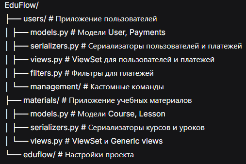

# EduFlow 🎓

**EduFlow** — современная образовательная платформа для создания и прохождения курсов и уроков с интегрированной платежной системой.

## 🚀 Возможности

### 📚 Образовательный функционал
- Создание структурированных курсов с модулями и уроками
- Управление контентом уроков (видео, описания, превью)
- Автоматический подсчет уроков в курсах
- Полный CRUD для курсов и уроков

### 👨‍🏫 Система пользователей
- Кастомная модель пользователя с авторизацией по email
- Расширенный профиль (телефон, город, аватар)
- История платежей в профиле пользователя
- Ролевая модель (преподаватели, студенты)

### 💰 Платежная система
- Полная система платежей за курсы и уроки
- Поддержка разных способов оплаты (наличные, перевод)
- Фильтрация и сортировка платежей
- История платежей в реальном времени

### 🔧 API возможности
- REST API с Django REST Framework
- Фильтрация платежей по курсу, уроку, способу оплаты
- Сортировка по дате и сумме платежей
- Вложенные сериализаторы для связанных данных

## 🛠 Технологии

- **Backend**: Python 3.12, Django 5.2
- **API**: Django REST Framework
- **База данных**: SQLite (разработка), готова к миграции на PostgreSQL
- **Качество кода**: flake8, black, isort, mypy
- **Аутентификация**: Кастомная по email + Token auth

## 📁 Структура проекта


## 🚀 Установка и запуск

1. **Клонируйте репозиторий:**
```bash
git clone <url-репозитория>
cd EduFlow
```
Установите зависимости:

```bash
pip install -r requirements.txt
```
Настройте базу данных:

```bash
python manage.py migrate
```
Создайте суперпользователя:

```bash
python manage.py createsuperuser
```
Заполните тестовыми данными:

```bash
python manage.py fill_payments
```
Запустите сервер:

```bash
python manage.py runserver
```
## 📚 API Endpoints
### Пользователи
 - GET/POST /api/users/ - список и создание пользователей

 - GET/PUT/PATCH /api/users/{id}/ - детализация и обновление

 - GET /api/users/me/ - профиль текущего пользователя с историей платежей

### Курсы
 - GET/POST /api/courses/ - список и создание курсов

 - GET/PUT/PATCH/DELETE /api/courses/{id}/ - CRUD операции

 - В ответе: количество уроков и детальная информация об уроках

### Уроки
 - GET/POST /api/lessons/ - список и создание уроков

 - GET/PUT/PATCH/DELETE /api/lessons/{id}/ - CRUD операции

### Платежи
 - GET /api/payments/ - список платежей с фильтрацией

 - Фильтры: ?course=1&payment_method=cash&ordering=-payment_date

## 🔍 Фильтрация платежей
### Сортировка
 - ordering=payment_date - по дате (старые сначала)

 - ordering=-payment_date - по дате (новые сначала) ✅ по умолчанию

 - ordering=amount - по сумме (возрастание)

 - ordering=-amount - по сумме (убывание)

### Фильтры
 - course=1 - платежи за курс с ID=1

 - lesson=2 - платежи за урок с ID=2

 - payment_method=cash - только наличные платежи

 - payment_method=transfer - только банковские переводы

## 🎯 Примеры использования
### Получение профиля с историей платежей
```bash
GET /api/users/me/
```
### Фильтрация платежей за конкретный курс
```bash
GET /api/payments/?course=1&ordering=-payment_date
```
### Создание курса с автоматическим подсчетом уроков
```bash
POST /api/courses/
{
    "title": "Python Advanced",
    "description": "Продвинутый курс",
    "owner": 1
}
```
## 🛠 Качество кода
Проект использует профессиональные инструменты качества:

```bash
# Форматирование кода
black .
isort .

# Проверка стиля
flake8 .

# Проверка типов
mypy .

# Полная проверка
make quality
```
## 📈 Статус разработки
✅ Реализовано:

 - Базовая структура проекта

 - Система пользователей и аутентификации

 - CRUD для курсов и уроков

 - Платежная система с фильтрацией

 - API документация через DRF Browsable API

🔄 В планах:

 - Система прав доступа

 - Валидация видео-ссылок

 - Пагинация и поиск

 - Тестирование

 - Docker-контейнеризация

## 🤝 Разработка
 - Присоединяйтесь к разработке! Мы используем:

 - Feature branches для новой функциональности

 - Code review для всех пул-реквестов

 - Professional code quality tools